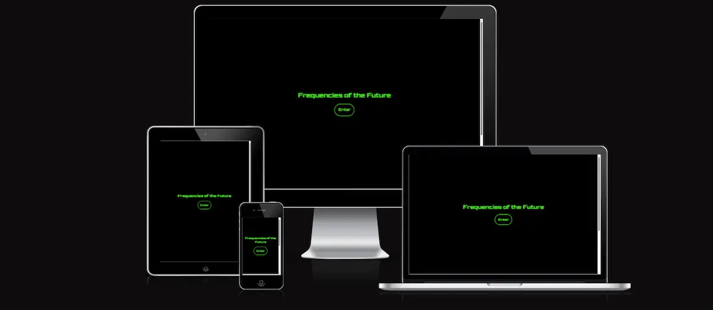
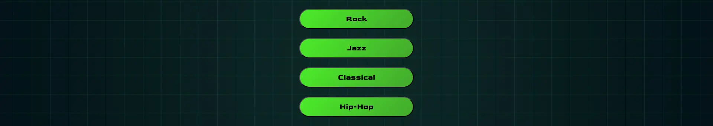
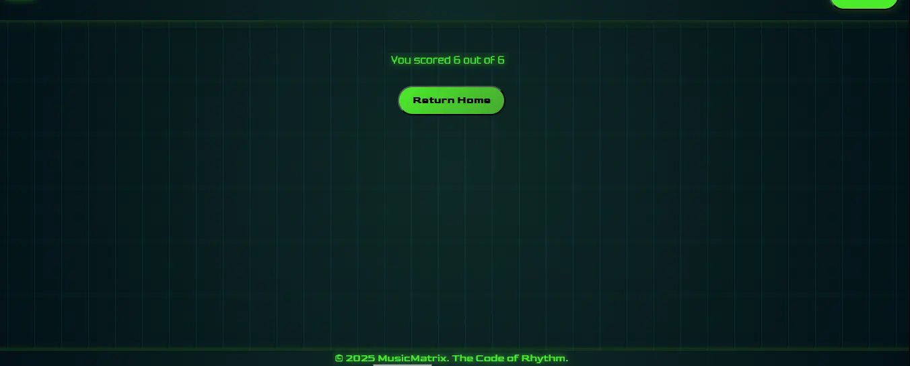
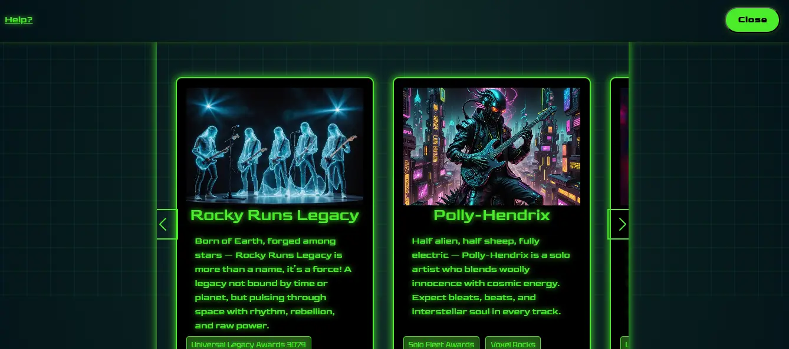
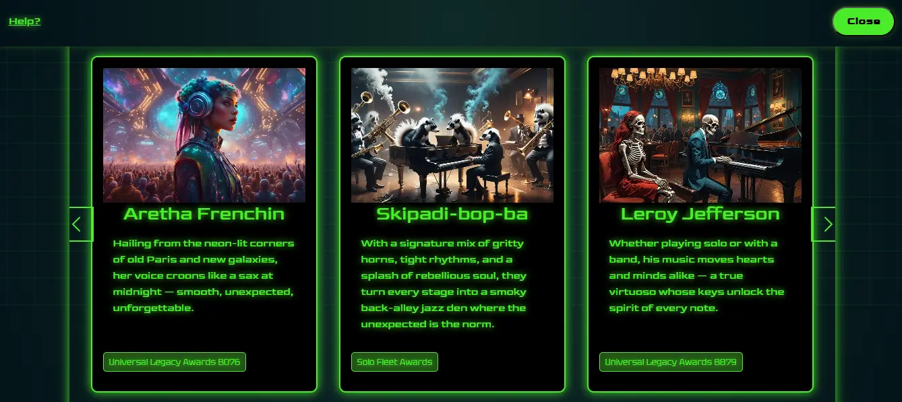
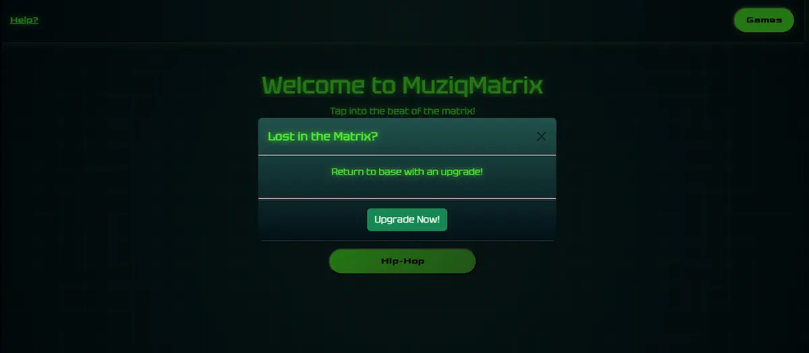

# Muziqmatrix

## Milestone Project 2

- This project aims to build an interactive front end website using HTML CSS and javaScript.
- I have decided to build a website tech-savy music explorers. Who'd like to discover new music artist and knowledge through triva and visual   engagement.
- My web page consists of:
  - A landing page with an enter button to grant yourself access to the site content.
  - A home page in which you can explore music artist based on genres.
  - A games button which currently holds a music triva quiz game to learn and discover. 

## Live project

- [View the live project here.](https://chia-codes.github.io/muziqmatrix/)

## Screenshots

### Landing page screenshot



### Home page screenshot


### Artist profile carousel screenshot


### Music Quiz screenshot


- All screenshots created using [Am I responsive](http://ami.responsivedesign.is/)


## User experience

### User Stories

#### New Visitor

  - As a new user, I want to explore different artist through genres through visual engagment 
  - As a new user, I would like to expand my music knowlegde through music trivia. 

#### Regular Users

  - I want to access music genres with ease with and see updated content. 
  - As a repeat user, I enjoyed the quiz and would like to explore new quesions to keep challenging myself.

#### Website owner

  - As the owner, the site to run smoothly across multiple devices for a consistent experiences.
  - As the owner, I want easily change and update content so that it stays fresh for users.

### WireFrames

- I've created WireFrames using Balsamiq and have included the links to access them in pdf form.

  - Landing page
    - [Desktop](docs/wireframes/landing-pg-desktop-wireframe.pdf)
    - [Tablet](docs/wireframes/landing-pg-tablet-wireframe.pdf)
    - [Mobile](docs/wireframes/landing-pg-mobile-wireframe.pdf)
  - Home page
    - [Desktop](docs/wireframes/home-pg-desktop-wireframe.pdf)
    - [Tablet](docs/wireframes/home-pg-tablet-wireframe.pdf)
    - [Mobile](docs/wireframes/home-pg-mobile-wireframe.pdf)
  - Artist Profile
    - [Desktop](docs/wireframes/artist-profile-wireframe.pdf)
    - [Tablet](docs/wireframes/artist-profile-tablet-wireframe.pdf)
    - [Mobile](docs/wireframes/artist-profile-mobile-wireframe.pdf)
  - Music Quiz
    - [Desktop](docs/wireframes/music-quiz-wireframe.pdf)
    - [Tablet](docs/wireframes/music-quiz-tablet-wireframe.pdf)
    - [Mobile](docs/wireframes/music-quiz-mobile-wireframe.pdf)

## Design

#### Colour Scheme

- Colour Code: I've created a dark futristc theme for this website using a radial-gradient(circle at center, #0f2a28, #021117) as my main background colour. My text is both jet black and neon green off white #00ff00 to contrast against the dark background.
- Extra style: I have alternated the a glow effect (bow-shadow) on hover too to show the user what elements are clickable.
-Style Mood: Futuristic - These colours were picked to to feel fully emersed with a site insipred by the martrix. 

#### Typography

- Font: I've used three fonts to keep consistent with the theme. Imported from google fonts they are, Tektur and Goldman for main content and Bruce Ace for games. 
- Fall-back: I used sans-serif as a fall-back font in the case for any reason my fonts were not imported.


#### Imagery

- Imagery was created by AI and imported from night cafe studio (https://creator.nightcafe.studio/)
This allowed me to foucus more on the structure of the code, as well as reach a goal to give a creative innovative feel to the site.

#### FavIcon

- A customed favicon is used in the browser tap for site branding.
- This will allow the user to easily identify the site in their browser.


## Features

### Landing Page 

#### Access Required

- With the help of BroCode youtube tutorial (details in the credit section) I have created an interactive canvas, in which you must click to access site contents. 
- This enter button feature hides after user has triggered a click only on the button. 


#### Home Page

  - This is where you can access and discover all content to the site. 

    - Genre Buttons

      - Through each interation will display different content in relation to genre button clicked.

      

    - Games Button

      - Successfully triggering the games button will hide the home page and display a music quiz.
      - This is an interative trivia game ensures users can easily and accessibly close music quiz if opened. 

       

    - Navbar Link (Help)

      - As a gimmicky fun element, the navbar link help is triggered with a bootstrap modal implementing 'cause and effect' with user interactivity.  
      - The modal is displays a message in reference to the matrix movies and allows an Event listener to be stimulated.

       

#### Music Quiz

  - This feature allows the user to enage in a bit of music trivia, challenging the user. 
  -The question and answers are dynamically loaded fom a data array.
  - The immediate feedback system allows tracking of score and question number in real-time. Displaying the final score at the end. 
  - Ensuring accesiibility across all devices the quiz interface is mobile friends and uses bootstrap custom classes for consistentcy and ease of use.
  - A restart and Exit button are displayed below the quiz to help improve user friendly expereinces.
  - Whilst the quiz is displayed the games button transition restart the quiz if it is clicked.
      - This feature in future would display a new game at random, when more games are added. 
     

    - Restart & Exit Button

      

    - Quiz Result

      


#### Artist Profiles

  - Triggered by the genre buttons, the artist profiles are displayed on a carousel with resposive indicators. 
  - Each profile card sits in a container to create background space for future adaptations. The carousel card also sit within ccontainer to give the apprence of depth in the screen to the user.

    - Rock Button Artist Carousel

      

    - Jazz Button Carousel

      

    - Classical Button Carousel

      

    - Hip-Hop Button Carousel

      

- #### Modal

  - This feature can be used to update the appreance of the site, performing a irreviersible change. For the user this creates and sense of control and excitement engaging with the site this way. 

      


### Features left to Implement.

- To enhance the use of the site, more content should be added, this includes:
    - Add artist profiles
    - Add quiz questions 
    - Add interactive music related games
- This quiz should display a message depending on the score results. 
- A digital design of a sin wave using javascript that is manipulated by the movement of the mouse.  
- Error message for idle activity or wrong trigger by user.

## Technologies used.

### Languages Used.

- [HTML5](https://en.wikipedia.org/wiki/HTML5)

  - HTML5 was used to create the content and sturctual base of each page.

- [CSS3](https://en.wikipedia.org/wiki/CSS)

  - CSS3 was used to then style the page and make it responsive through media queries, and interactive through using CSS transitions.

- [JavaScript](https://en.wikipedia.org/wiki/JavaScript)
  - JavaScript was used throughout the website to make the site interactive. The JavaScript will change what is being shown to the user depending on what they click.

### Frameworks Libraries and Programs.

- [Bootstrap v5.3](https://getbootstrap.com/)

  - Bootstrap is used throughout the site, implementing buttons and a carousel to make muziqmatrix responsive.

- [jQuery](https://jquery.com/)

  - jQuery was used throught the Javascript file keep code clear and consice.

- [Jest](https://jestjs.io/)

  - Jest was used to writing and execute automated tests for the page.

- [Google Fonts](https://fonts.google.com/)

  - Google fonts imported for design aspect of the site. 

- [Night Cafe](https://creator.nightcafe.studio/)

  - Night cafe libaries used to incoporate relevant imagery for aritst profiles. 

- [Squoosh](https://squoosh.app/)

  - Squoosh used to compress image files to keep load time low. 

- [Am I responsive](http://ami.responsivedesign.is/)

  - Am I responsive was used to taking screenshots of the page at different screen sizes.

- [Github](https://github.com/)

  - Github was used to create and store the project progress repository.

- [Gitpod](https://gitpod.io/)

  - Gitpod was used to create my files and code the project.

- [Balsamiq](https://balsamiq.com/)

  - Balsamiq was used to create Wireframes for the project during the initial planning stage.

- [VS Code](https://code.visualstudio.com/)

  - Used to write store, pull and push repository through github. 

### Application Programming Interface (API's)

- [Webkit](https://webkit.org/)

  - Webkit is used for allowing users acces to fullscreen mode. 

## Testing <---------------------------------------------------------------------------------------------------->

Chrome DevTools was used throughout development and testing the deployed website to check for accessibility issues.

Testing was focused on the following criteria:

### Responsiveness


  
## Lighthouse Testing Before Fixes

#### Landing Page

#### Home Page

#### Artist Profile Carousel

#### Music Quiz


# Lighthouse Testing After Fixes

#### Landing Page

#### Home Page

#### Artist Profile Carousel

#### Music Quiz


### Functional Testing

**Navigation Links**


Links on all pages navigated to the correct pages and section as expected.


### Validator Testing 

- HTML

- CSS

- JavaScript

### Unfixed Bugs


#### Testing

## Deployment 

### Version Control

The site was created using the Visual Studio Code editor and pushed to github to the remote repository ‘Portfolio-Project-2-Poker-Fun’.

The following git commands were used throughout development to push code to the remote repo:

```git add <file>``` - This command was used to add the file(s) to the staging area before they are committed.

```git commit -m “commit message”``` - This command was used to commit changes to the local repository queue ready for the final step.

```git push``` - This command was used to push all committed code to the remote repository on github.

### Deployment to Github Pages

- The site was deployed to GitHub pages. The steps to deploy are as follows:
  - In the GitHub repository, navigate to the Settings tab
  - From the menu on left select 'Pages'
  - From the source section drop-down menu, select the Branch: main
  - Click 'Save'
  - A live link will be displayed in a green banner when published successfully.

The live link can be found here - (https://chia-codes.github.io/muziqmatrix/)

### Clone the Repository Code Locally

Navigate to the GitHub Repository you want to clone to use locally:

- Click on the code drop down button
- Click on HTTPS
- Copy the repository link to the clipboard
- Open your IDE of choice (git must be installed for the next steps)
- Type git clone copied-git-url into the IDE terminal

The project will now have been cloned on your local machine for use.

## UX & UI Considerations

This website is buit with a 'mobile first' thought pattern. As most online users are highly likey to view the sight through a mobile or tablet, a mobile first approach is essential to the user experience.
The design follows the five planes of UX design:

**Strategy** – Set user needs and goals to ensure the site serves the recruiter and site manager.
**Scope** – Contain features such as the about, skills, and portfolio sections.
**Structure** – Design a logical easy-to-use structure that invitews easy navigation and ease of access.
**Skeleton** – Create wireframes to brainstorm and map out the layout the site.
**Surface** – Develop an appealing unique site with an elegant color scheme and subtle design elements.

## Credits

### Code

#### Stack Overflow.

  - [Carousel Items Loop](https://stackoverflow.com/questions/72690608/carousel-slideshow-with-infinite-loop)

    - Used to help navigate in creating a loop for the carousel cards in the artist profile section. 

  - [Deal with localStorage in Jest](https://stackoverflow.com/questions/32911630/how-do-i-deal-with-localstorage-in-jest-tests)

    - Used to workout how to mock html file during jest test.

#### Code Camp

  - [Fullscreen API in JavaScript](https://www.freecodecamp.org/news/how-use-full-screen-api-in-js/)

    - Used to discover Webkit API and incorporate fullscreen transition.
  ```if (this.requestFullscreen) {this.requestFullscreen();}```

#### Code Pen 

  - [Enhanced Futuristic Styling](https://codepen.io/dspstudio/pen/XJJNBrZ)

    - Used to inspire the background and grid layout of the site. CSS background customised.

    **WebVision Projects CSS**
  ``` body{	background: radial-gradient(circle at center, #0f172a, #020617); min-height: 100vh; display: flex;justify-content: center; align-items: center;overflow: hidden; position: relative;}```
    **Grid Background**
  ``` body::before {content: ""; position: absolute;	top: 0;	left: 0;	right: 0;	bottom: 0;	background-image: linear-gradient(rgba(14, 165, 233, 0.1) 1px, transparent 1px),	linear-gradient(90deg, rgba(14, 165, 233, 0.1) 1px,transparent 1px);	background-size: 40px 40px;	background-position: center center;	perspective: 1000px; transform-style: preserve-3d;	animation: gridMove 60s linear infinite; } ```

#### Jest 29.7

  - [Writing Test](https://jestjs.io/)

    - Used to set up learn, rewrite tests
``` beforeAll(() => {  let fs = require("fs");  let fileContents = fs.readFileSync("index.html", "utf-8");  document.body.innerHTML = fileContents;})``` 
```test("Jest should pass 1 test", () => { expect(1 + 1).toBe(2);});```

#### Google 

  - [Google](https://www.google.com)

    - Google fonts for styling https://fonts.google.com/
    - Chrome Developers used to read, discover and learn how different codes used, for this website implementing 'preload' & 'preconnect' https://developer.chrome.com/docs/devtools/application/debugging-speculation-rules
    - Chrome DevTools, lighthouse used to test and examin code performance and accessibility.

#### Canva 
  -[Canva](https://www.canva.com/)
  
    - Used to create favicon for site branding.

#### Favicon.io

  - [Favicon](https://favicon.io/favicon-converter/)

    - Used to convert icon sizes to have icon across all devices. 


### Content

- All text for the website was written by myself.

### Media

- [Night Cafe](https://creator.nightcafe.studio/)

  - All images for the website were obtained from Nightcafe.

