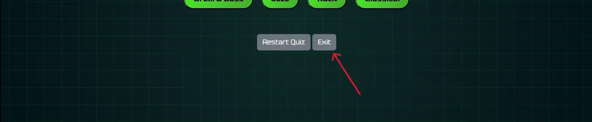
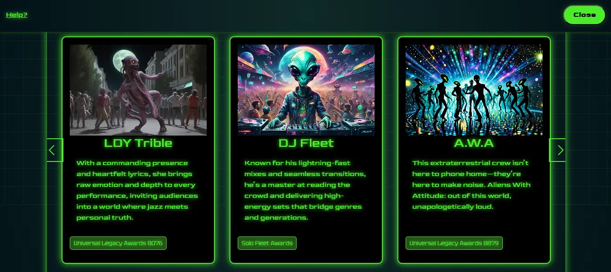

# Muziqmatrix

## Milestone Project 2

**This intent for creating Muziqmatrix site is to portfolio my skills working with JavaScript, I am keen to keep improving this site's build**

- This project aims to build an interactive front end website using HTML CSS and JavaScript.
- I have decided to build a website tech-savy music explorers. Who'd like to discover new music artist and knowledge through triva and visual   engagement.
- My web page consists of:
  
  - A landing page with an enter button to grant yourself access to the site content.
  - A home page in which you can explore music artist based on genres.
  - A games button which currently holds a music triva quiz game to learn and discover. 

## Live project

- [View the live project here.](https://chia-codes.github.io/muziqmatrix/)

## Screenshots

### Landing page screenshot


### Home page screenshot


### Artist profile carousel screenshot


### Music Quiz screenshot


- All screenshots created using [Am I responsive](http://ami.responsivedesign.is/)


## User experience

### User Stories

#### New Visitor

  - As a new user, I want to explore different artist through genres through visual engagment 
  - As a new user, I would like to expand my music knowlegde through music trivia. 

#### Regular Users

  - I want to access music genres with ease with and see updated content. 
  - As a repeat user, I enjoyed the quiz and would like to explore new quesions to keep challenging myself.

#### Website owner

  - As the owner, the site to run smoothly across multiple devices for a consistent experiences.
  - As the owner, I want easily change and update content so that it stays fresh for users.

### WireFrames

- I've created WireFrames using Balsamiq and have included the links to access them in pdf form.

  - Landing page
    - [Desktop](docs/wireframes/landing-pg-desktop-wireframe.pdf)
    - [Tablet](docs/wireframes/landing-pg-tablet-wireframe.pdf)
    - [Mobile](docs/wireframes/landing-pg-mobile-wireframe.pdf)
  - Home page
    - [Desktop](docs/wireframes/home-pg-desktop-wireframe.pdf)
    - [Tablet](docs/wireframes/home-pg-tablet-wireframe.pdf)
    - [Mobile](docs/wireframes/home-pg-mobile-wireframe.pdf)
  - Artist Profile
    - [Desktop](docs/wireframes/artist-profile-desktop-wireframe.pdf)
    - [Tablet](docs/wireframes/artist-profile-tablet-wireframe.pdf)
    - [Mobile](docs/wireframes/artist-profile-mobile-wireframe.pdf)
  - Music Quiz
    - [Desktop](docs/wireframes/music-quiz-desktop-wireframe.pdf)
    - [Tablet](docs/wireframes/music-quiz-tablet-wireframe.pdf)
    - [Mobile](docs/wireframes/music-quiz-mobile-wireframe.pdf)

## Design

#### Colour Scheme

- Colour Code: I've created a dark futristc theme for this website using a radial-gradient(circle at center, #0f2a28, #021117) as my main background colour. My text is both jet black and neon green off white #00ff00 to contrast against the dark background.
- Extra style: I have alternated the a glow effect (bow-shadow) on hover too to show the user what elements are clickable.
-Style Mood: Futuristic - These colours were picked to to feel fully emersed with a site insipred by the martrix. 

#### Typography

- Font: I've used three fonts to keep consistent with the theme. Imported from google fonts they are, Tektur and Goldman for main content and Bruce Ace for games. 
- Fall-back: I used sans-serif as a fall-back font in the case for any reason my fonts were not imported.


#### Imagery

- Imagery was created by AI and imported from night cafe studio (https://creator.nightcafe.studio/)
This allowed me to foucus more on the structure of the code, as well as reach a goal to give a creative innovative feel to the site.

#### FavIcon

- A customed favicon is used in the browser tap for site branding.
- This will allow the user to easily identify the site in their browser.


## Features

### Landing Page 

#### Access Required

- With the help of BroCode youtube tutorial (details in the credit section) I have created an interactive canvas, in which you must click to access site contents. 
- This enter button feature hides after user has triggered a click only on the button. 


#### Home Page

  - This is where you can access and discover all content to the site. 

    - Genre Buttons

      - Through each interation will display different content in relation to genre button clicked.

      

    - Games Button

      - Successfully triggering the games button will hide the home page and display a music quiz.
      - This is an interative trivia game ensures users can easily and accessibly close music quiz if opened. 

      

    - Navbar Link (Help)

      - As a gimmicky fun element, the navbar link help is triggered with a bootstrap modal implementing 'cause and effect' with user interactivity.  
      - The modal is displays a message in reference to the matrix movies and allows an Event listener to be stimulated.

       

#### Music Quiz

  - This feature allows the user to enage in a bit of music trivia, challenging the user. 
  -The question and answers are dynamically loaded fom a data array.
  - The immediate feedback system allows tracking of score and question number in real-time. Displaying the final score at the end. 
  - Ensuring accesiibility across all devices the quiz interface is mobile friends and uses bootstrap custom classes for consistentcy and ease of use.
  - A restart and Exit button are displayed below the quiz to help improve user friendly expereinces.
  - Whilst the quiz is displayed the games button transition restart the quiz if it is clicked.
      - This feature in future would display a new game at random, when more games are added. 
     

    - Restart & Exit Button

      

      

    - Quiz Result

      


#### Artist Profiles

  - Triggered by the genre buttons, the artist profiles are displayed on a carousel with resposive indicators. 
  - Each profile card sits in a container to create background space for future adaptations. The carousel card also sit within ccontainer to give the apprence of depth in the screen to the user.

    - Rock Button Artist Carousel

      

    - Jazz Button Carousel

      

    - Classical Button Carousel

      

    - Hip-Hop Button Carousel

      

- #### Modal

  - This feature can be used to update the appreance of the site, performing a irreviersible change. For the user this creates and sense of control and excitement engaging with the site this way. 

      


### Features left to Implement

- To enhance the use of the site, more content should be added, this includes:
    - Add artist profiles
    - Add quiz questions 
    - Add interactive music related games
    - Add artist music for users experience
- This quiz should display a message depending on the score results. 
- A digital design of a sin wave using javascript that is manipulated by the movement of the mouse.
    - The idea to to make the carousel look as if its floating in empty space.  
- Error message for idle activity or wrong trigger by user.
- Get music quiz question to be displayed in random order so the first displayed is not always the correct answer. 


## Technologies

### Languages Used

- [HTML5](https://en.wikipedia.org/wiki/HTML5)

  - HTML5 was used to create the content and sturctual base of each page.

- [CSS3](https://en.wikipedia.org/wiki/CSS)

  - CSS3 was used to then style the page and make it responsive through media queries, and interactive through using CSS transitions.

- [JavaScript](https://en.wikipedia.org/wiki/JavaScript)
  - JavaScript was used throughout the website to make the site interactive. The JavaScript will change what is being shown to the user depending on what they click.

### Frameworks Libraries and Programs

- [Bootstrap v5.3](https://getbootstrap.com/)

  - Bootstrap is used throughout the site, implementing buttons and a carousel to make muziqmatrix responsive.

- [jQuery](https://jquery.com/)

  - jQuery was used throught the Javascript file keep code clear and consice.

- [Jest](https://jestjs.io/)

  - Jest was used to writing and execute automated tests for the page.

- [Google Fonts](https://fonts.google.com/)

  - Google fonts imported for design aspect of the site. 

- [Night Cafe](https://creator.nightcafe.studio/)

  - Night cafe libaries used to incoporate relevant imagery for aritst profiles. 

- [Squoosh](https://squoosh.app/)

  - Squoosh used to compress image files to keep load time low. 

- [Am I responsive](http://ami.responsivedesign.is/)

  - Am I responsive was used to taking screenshots of the page at different screen sizes.

- [Github](https://github.com/)

  - Github was used to create and store the project progress repository.

- [Gitpod](https://gitpod.io/)

  - Gitpod was used to create my files and code the project.

- [Balsamiq](https://balsamiq.com/)

  - Balsamiq was used to create Wireframes for the project during the initial planning stage.

- [VS Code](https://code.visualstudio.com/)

  - Used to write store, pull and push repository through github. 

### Application Programming Interface (API's)

- [Webkit](https://webkit.org/)

  - Webkit is used for allowing users acces to fullscreen mode. 

## Testing 

Chrome DevTools was used throughout development and testing the deployed website to check for accessibility issues.

Testing was focused on the following criteria:

- All buttons have associated types and aria-labels in accordance to WCAG guidlines to ensure accessibility of the visually impaired. 
- All images and media content has alternative descriptive text for screen readers.
- Making sure WCAG 2.1 recommended coding practices are being followed.

### Responsiveness
  
  All pages were tested to ensure responsiveness on screen sizes from 320px and upwards as defined in [WCAG 2.1 Reflow criteria for responsive design](https://www.w3.org/WAI/WCAG21/Understanding/reflow.html) on Chrome, Edge, Firefox and Opera browsers.

#### Manual Testing 

Verifying that the carousel displays correctly across devices (e.g., mobile vs. desktop).

Checking if genre buttons correctly style and reveal the artist profiles visually.

Confirming that the full-screen button appears and closes the way a user would expect.

Making Bootstrap modals open/close properly when navigating manually.

- Manual tests were performed to ensure the website is accessible as possible and some accessibility issues were identified.

#### Automated Testing

Ensuring that clicking the 'Games' button hides the home page and shows the quiz.

Verifying that the score resets to 0 when ```resetQuiz()``` is called.

Checking that the first quiz question appears correctly from the quizData object.

Testing that ```requestFullscreen()``` is triggered when a carousel card is clicked.


Steps to test:

1. Open browser and navigate to [Muziqmatrix](https://chia-codes.github.io/muziqmatrix/)
2. Open the developer tools (right click and inspect)
3. Set to responsive and decrease width to 320px
4. Set the zoom to 50%
5. Click and drag the responsive window to maximum width

Expected:

Website is responsive on all sizes and no images stretched.
No horizontal scroll is present.
No elements overlap.

Actual:

Website behaved as expected with the exception of not being able to go use fullscreen feature on mobiles and artist carousel does not fit to screen on mobiles which caused missed content on page first load.

Website was also opened on the following devices and the same responsive issues were seen:

- Samsung Galaxy S23
- iphone 14
- iPhone 12
- Dell Desktop-AH44THS

### Accessibility

[Wave Accessibility](https://wave.webaim.org/) tool was used throughout development and for final testing of the deployed website to check for any aid accessibility testing.

Testing was focused to ensure the following criteria were met:

- All buttons have associated labels or aria-labels for screen reader users
- Color contrasts meet a minimum ratio as specified in [WCAG 2.1 Contrast Guidelines](https://www.w3.org/WAI/WCAG21/Understanding/contrast-minimum.html)
- Heading levels are not missed or skipped to ensure the importance of content is relayed correctly to the end user
- All content is contained within landmarks to ensure ease of use for assistive technology, allowing the user to navigate by page regions
- All not textual content had alternative text or titles so descriptions are read out to screen readers
- HTML page lang attribute has been set
- WCAG 2.1 Coding best practices being followed


#### Issue #1: h1, footer element and enter button did not have a fallback color for background 

**Fix**: Independantly and manually add set black background to landing page and enter button to sit visibly with neon green text.

#### Issue #2: Empty alternative text for images and missing aria-labels.

**Fix**: Fill in alternative text values and add aria labels. 

#### Issue #3: Artist profile on mobile devices hides part of the content.

**Fix**: Media query add to carousel container to ensure responsivness.

#### Issue #4: Artist profile on mobile devices does not enter fullscreen after clicked.

**Fix**: This is currently not fixed and a solution is currently being worked out.

#### Issue #5: Close button does not display on all profile cards when entered ```fullscreen``` mode

**Fix**: Add close button to html carousel cards, create ```if {} else {}``` statement to toggle and display close button in fullscreen. 


## Site Wide

### Landing Page Button

Testing was performed to ensure the enter button on the landing page was hidden after click to display main content.

| Landing Page |   Load    |
| --------------- | ------------------ |
| Enter button on click  |  Hide landing page |

### Navbar Links & Button

Testing was performed to ensure all navigation links and buttons display to the correct content to the page as per design. This was done by clicking on the navigation links and buttons on each section.

| Navigation Link |    Load    |
| --------------- | ------------------ |
| Help?           |  Display modal     |
| Games           |  Display music quiz      |

Links on nabar behaved as exptected.


### Games Button

Testing was performed to ensure the enter button on the landing page was hidden after click to display main content.

| Landing Page |   Load    |
| --------------- | ------------------ |
| Enter button on click  |  Hide landing page |

Games button on nabar behaved as exptected.

#### Games button whilst music quiz is displayed

Testing was performed to ensure the games button on the landing page opens music quiz. Once music quiz is open the games button resets the quiz to start again. 

| Music Quiz |   Load    |
| --------------- | ------------------ |
| Games button on click  |  Resets music quiz score |

Games on nabar behaved as exptected, when music quiz was displayed.

### Genre Buttons
  #### Rock Button
Testing was performed to ensure the rock button on the landing page was displayed artist carousel with rock artist content.

| Landing Page |   Load    |
| --------------- | ------------------ |
| Rock button on click  |  Hide landing page |
|                       | Display artist profile with rock artist content inside     |

#### Jazz Button
Testing was performed to ensure the rock button on the landing page was displayed artist carousel with jazz artist content.

| Landing Page |   Load    |
| --------------- | ------------------ |
| Jazz button on click  |  Hide landing page |
|                       | Display artist profile with jazz artist content inside     |

#### Classical Button
Testing was performed to ensure the rock button on the landing page was displayed artist carousel with classical artist content.

| Landing Page |   Load    |
| --------------- | ------------------ |
| Classical button on click  |  Hide landing page |
|                       | Display artist profile with classical artist content inside     |

#### Hip-hop Button
Testing was performed to ensure the rock button on the landing page was displayed artist carousel with hip-hop artist content.

| Landing Page |   Load    |
| --------------- | ------------------ |
| Hip-hop button on click  |  Hide landing page |
|                       | Display artist profile with Hip-hop artist content inside     |

All genre buttons behaved as exptected.

### Restart button (Music-quiz)

Testing was performed to ensure the restart button once music quiz is displayed reloads question for the music quiz and resets the score.

| Music Quiz |   Load    |
| --------------- | ------------------ |
| Restart button on click  |  Resets music quiz  |

Restart button on music quiz behaved as expected. 

### Exit button (Music-quiz)

Testing was performed to ensure the exit button once music quiz is displayed hides music quiz and displays the home page.

| Music Quiz |   Load    |
| --------------- | ------------------ |
| Exit button on click  |  Hides music quiz  |
|                       |  Displays home page content |

Restart button on music quiz behaved as expected. 

### Close button (Artist Profile Carousel)

Testing was performed to ensure the close button on artist profile hides artist profile and displays home page. 

| Artist Profile Carousel |   Load    |
| --------------- | ------------------ |
| Close button on click  |  Hide artist carousel |
|                         |  Display home page|

Close button behaved as expected. 

### Close button (Artist Profile Fullscreen)

Testing was performed to ensure the close button on artist profile in fullscreen mode exits fullscreen and display artist profile carousel. 

| Artist Profile Fullscreen |   Load    |
| --------------- | ------------------ |
| Close button on click  |  Hide artist profile |
|                         |  Display pre screen (artist carousel)|

Close button did not behave as expected and was not visible on all artist profile cards when in full screen.

### Music Quiz

Tested using jest [Jest](https://jestjs.io/) and jsdom [Jsdom](https://github.com/jsdom/jsdom) to ensure consistant and reliable user experience. Used console.log used throughout my code to and fix bugs in Chrome dev tools [Chrome](https://developer.chrome.com/docs/devtools) 

#### Quiz Start
  - Confirmation that the quiz has started:

    - Games button clicked
      - Home page is hidden
      - Quiz section is displayed
      - First question correctly loaded from ```quizData``` array

Initialisation of music quiz behaved as expected.

```expect($("#home-page").hasClass("hidden")).toBe(true);```

```expect($("#quiz-section").hasClass("hidden")).toBe(false);```

```expect($("#quiz-question").text()).toContain(quizData[0].question);```

#### Submit Answer
  - Checks when user selects an answer triggered by click

    - Correct answer, score increase by 1
    - Incorrect andswer, score remains the same
    - Post answer click the next question is displayed
    - On last question final score is displayed
    - Score resets to 0

Answer submission for quiz questions behaved as expected. 

```$("#quiz-options").val(correctAnswer);```

```$("#submit-answer").trigger("click");```

```expect(score).toBe(1);```

```expect(currentQuestionIndex).toBe(1);```

#### Display Score
  - Checks when quiz is at final question and displays score

    - Quiz section is hidden
    - Score is displayed
    - Message shows correct score number

Score display for quiz questions behaved as expected. 

```expect($("#quiz-section").hasClass("hidden")).toBe(true);```

```expect($("#quiz-score").hasClass("hidden")).toBe(false);```

```expect($("#score-message").text()).toContain("Your final score is");```

#### Restart Button
  - Confirms quiz has been reset

    - Resets score index to 0
    - Resets question index to 0
    - Hides score screen
    - Displays first question

Restart button for quiz questions behaved as expected. 

```expect(score).toBe(0);```

```expect(currentQuestionIndex).toBe(0);```

```expect($("#quiz-section").hasClass("hidden")).toBe(false);```

```expect($("#quiz-score").hasClass("hidden")).toBe(true);```

#### Artist Carousel Indicators
**Starting carousel indicator state**
  - Carousel component of the left and right arrows to navigate between artist profile cards

    - Clicking the right indicator button shows the next artist carousel card
    - Clicking the left indicator buttons shows the prev carousel card

```$("#carousel-right").trigger("click");```

```expect(currentArtistIndex).toBe(1);```


```$("#carousel-left").trigger("click");```

```expect(currentArtistIndex).toBe(0);```

**Wraparound Behaviour**
  - Ensures right indicator wraps carousel to first artist on the last card

```currentArtistIndex = 0;```

```$("#carousel-left").trigger("click");```

```expect(currentArtistIndex).toBe(2);```

  - Ensures right indicator wraps carousel to last artist on the first card

```currentArtistIndex = 2;```

```$("#carousel-right").trigger("click");```

```expect(currentArtistIndex).toBe(0);```

Carousel indicators behaved as expected. 

### Validator Testing 

#### HTML
 
- No errors were returned when passing through the official [W3C validator](https://validator.w3.org)


#### CSS

- No errors were returned when passing through the official [Jigsaw CSS validator](https://jigsaw.w3.org/css-validator/validator)


### JavaScript
- Multiple errors returned passing through offical [JShint checker](https://jshint.com/) 

**Errors**

| Line| Column | Source | Message |
| --------------- | --------------- | --------------- | --------------- |
| 24  | 42 | ("enter-btn")?**.**addEventListener| Unexpected token |
| 37  |    | bootstrap | undefined |
| 352 | 12 | selected === correct && score++; | Expected an assignment or function |
| 355 | 25 | ? (currentQuestion++, loadQuestion()) | undefined |
| 454 |     | module | undefined |
|     |     | $ | undefined |

**Before Fixes**


**After Fixes**
- Fixes logged on commits


**Lighthouse**


### Unfixed Bugs

#### Issue #1: Close button does not appear

**Unfixed**: Close button does not display when artist profile card (carousel-cards) are shown. 

#### Issue #2: Genre button 'classical'

**Unfixed**: After site has been interacted with, clicking on genre but classical shows carousel starting with the last card.

#### Issue #3: Image on Card 3 carousel 

**Unfixed**: The image third carousel card sits to the left of its container and does reach the same width as the others. 

#### Issue #4: Upgrade Button on Modal

**Unfixed**: The upgrade now button is not a working funciton, currently being built. 

## Deployment 

### Version Control

The site was created using the Visual Studio Code editor and pushed to github to the remote repository ‘Portfolio-Project-2-Poker-Fun’.

The following git commands were used throughout development to push code to the remote repo:

```git add <file>``` - This command was used to add the file(s) to the staging area before they are committed.

```git commit -m “commit message”``` - This command was used to commit changes to the local repository queue ready for the final step.

```git push``` - This command was used to push all committed code to the remote repository on github.

### Deployment to Github Pages

- The site was deployed to GitHub pages. The steps to deploy are as follows:
  - In the GitHub repository, navigate to the Settings tab
  - From the menu on left select 'Pages'
  - From the source section drop-down menu, select the Branch: main
  - Click 'Save'
  - A live link will be displayed in a green banner when published successfully.

The live link can be found here - (https://chia-codes.github.io/muziqmatrix/)

### Clone the Repository Code Locally

Navigate to the GitHub Repository you want to clone to use locally:

- Click on the code drop down button
- Click on HTTPS
- Copy the repository link to the clipboard
- Open your IDE of choice (git must be installed for the next steps)
- Type git clone copied-git-url into the IDE terminal

The project will now have been cloned on your local machine for use.

## UX & UI Considerations

This website is buit with a 'mobile first' thought pattern. As most online users are highly likey to view the sight through a mobile or tablet, a mobile first approach is essential to the user experience.
The design follows the five planes of UX design:

**Strategy** – Set user needs and goals to ensure the site serves the recruiter and site manager.
**Scope** – Contain features such as the about, skills, and portfolio sections.
**Structure** – Design a logical easy-to-use structure that invitews easy navigation and ease of access.
**Skeleton** – Create wireframes to brainstorm and map out the layout the site.
**Surface** – Develop an appealing unique site with an elegant color scheme and subtle design elements.

## Credits

### Code

#### Stack Overflow.

  - [Carousel Items Loop](https://stackoverflow.com/questions/72690608/carousel-slideshow-with-infinite-loop)

    - Used to help navigate in creating a loop for the carousel cards in the artist profile section. 

  - [Deal with localStorage in Jest](https://stackoverflow.com/questions/32911630/how-do-i-deal-with-localstorage-in-jest-tests)

    - Used to workout how to mock html file during jest test.

#### Code Camp

  - [Fullscreen API in JavaScript](https://www.freecodecamp.org/news/how-use-full-screen-api-in-js/)

    - Used to discover Webkit API and incorporate fullscreen transition.
  ```if (this.requestFullscreen) {this.requestFullscreen();}```

#### Code Pen 

  - [Enhanced Futuristic Styling](https://codepen.io/dspstudio/pen/XJJNBrZ)

    - Used to inspire the background and grid layout of the site. CSS background customised.

    **WebVision Projects CSS**
  ``` body{	background: radial-gradient(circle at center, #0f172a, #020617); min-height: 100vh; display: flex;justify-content: center; align-items: center;overflow: hidden; position: relative;}```

    **Grid Background**
  ``` body::before {content: ""; position: absolute;	top: 0;	left: 0;	right: 0;	bottom: 0;	background-image: linear-gradient(rgba(14, 165, 233, 0.1) 1px, transparent 1px),	linear-gradient(90deg, rgba(14, 165, 233, 0.1) 1px,transparent 1px);	background-size: 40px 40px;	background-position: center center;	perspective: 1000px; transform-style: preserve-3d;	animation: gridMove 60s linear infinite; } ```

#### Jest 29.7

  - [Writing Test](https://jestjs.io/)

    - Used to set up learn, rewrite tests

``` beforeAll(() => {```  

```let fs = require("fs");```  

```let fileContents = fs.readFileSync("index.html", "utf-8");```

```document.body.innerHTML = fileContents;})``` 

```test("Jest should pass 1 test", () => { expect(1 + 1).toBe(2);});```

#### Google 

  - [Google](https://www.google.com)

    - Google fonts for styling https://fonts.google.com/
    - Chrome Developers used to read, discover and learn how different codes used, for this website implementing 'preload' & 'preconnect' https://developer.chrome.com/docs/devtools/application/debugging-speculation-rules
    - Chrome DevTools, lighthouse used to test and examin code performance and accessibility.

#### Canva 
  - [Canva](https://www.canva.com/)
  
    - Used to create favicon for site branding.

#### Favicon.io

  - [Favicon](https://favicon.io/favicon-converter/)

    - Used to convert icon sizes to have icon across all devices. 


### Content

- All text for the website was written by myself.

### Media

- [Night Cafe](https://creator.nightcafe.studio/)

  - All images for the website were obtained from Nightcafe.

#### Coders Notes:

The purpose of this project is to display and promote my javascript skills. As this is my first solo project using javascript there eveidently much more to learn, and I am keen to build of this code to improve and expand on what ive hav already created. It still needs work, but thank youf or looking through the muziqmatrix project. 
